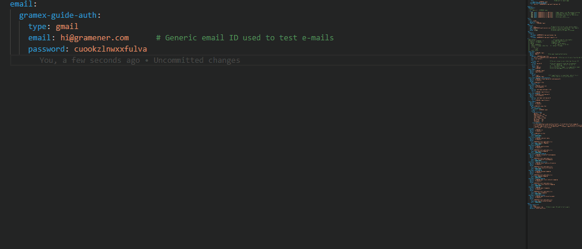

# gramexsnippets README

`YAML` code snippets for `Gramex` endpoints.

## Requirements

Needs `VSCode 1.31` or above.

## How to use

In `gramex.yaml` or any `.yaml` file, type `grx-form`... it should prompt two `FormHandler` related snippets as suggestions.

Supported snippet commands:

- `grx-filehandler`
- `grx-functionhandler`
- `grx-formhandler_db`
- `grx-formhandler_csv`
- `grx-email`
- `grx-custom_session`
- `grx-custom_log`
- `grx-cache_assets`
- `grx-auth_db`
- `grx-auth_google`
- `grx-auth_simple`
- `grx-alert`
- `grx-capture`
- `grx-schedule`

Use `tab` to change default parameters.

## Features

Auto-complete YAML configuration for `Gramex` endpoints.

Current features:

- `FileHandler` endpoint
- `FormHandler` flat files and database endpoints
- `auth` endpoints
- Custom `log` and `session` configurations
- `email` service
- Caching assets

## Release Notes

Current features include configuration for `FormHandler`, `log`, `session`, `email`, caching assets

View `CHANGELOG` for release-wise changes.
